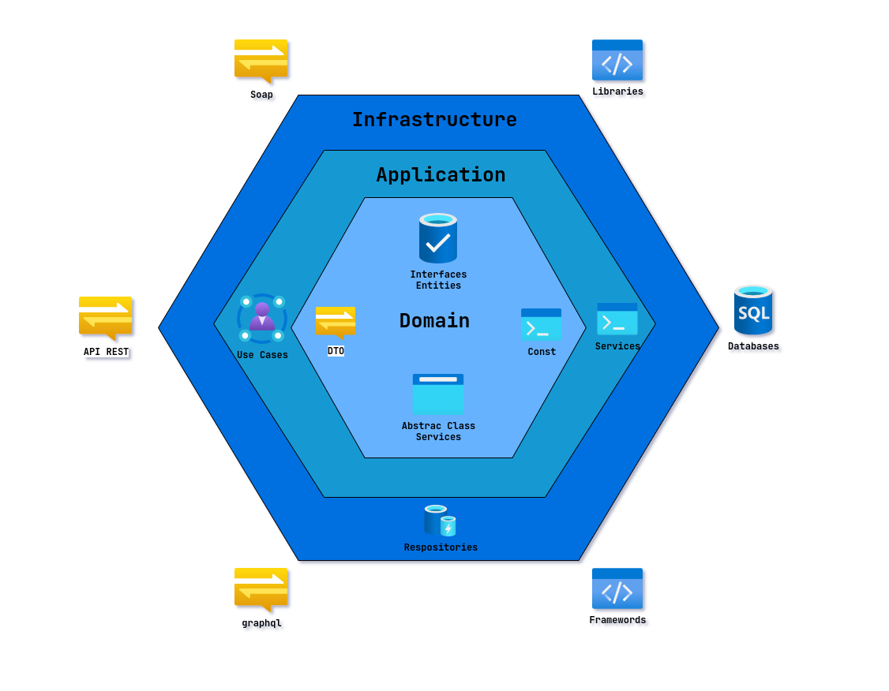
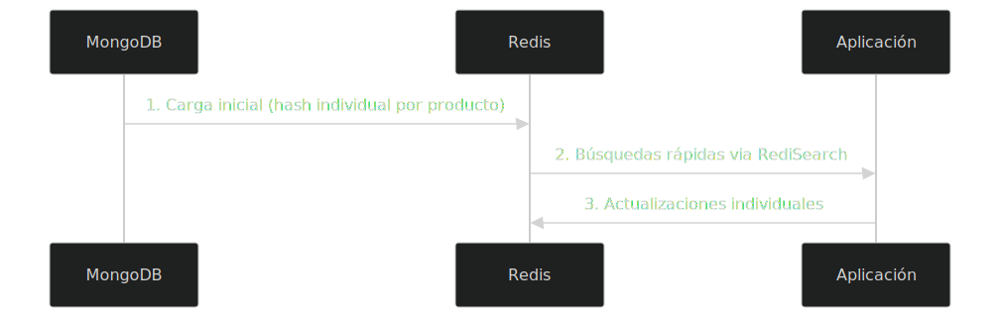
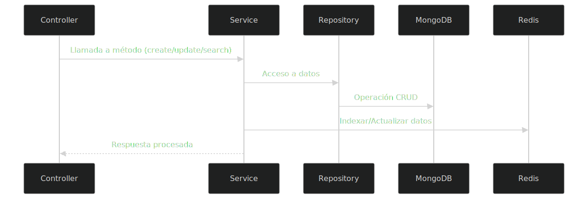

# 🚀 Sistema de Búsqueda Avanzada con NestJS, Redis y MongoDB

## 🛠 Tecnologías Principales

<p align="center">
  
  
  
</p>

## 📋 Descripción

Sistema backend construido con **NestJS** que implementa:

- Arquitectura **Hexagonal** + **DDD**
- Búsqueda avanzada con **Redis** (RediSearch)
- Persistencia principal en **MongoDB**
- API REST documentada

<p align="center">
  <a href="" rel="noopener">
 </a>
</p>
<p align="center">
  <a href="" rel="noopener">
 </a>
</p>
<p align="center">
  <a href="" rel="noopener">
 </a>
</p>

```bash
src/
├── modules/
│ ├── products/ # Ejemplo módulo principal
│ │ ├── applications/
│ │ │ └── services/ # Lógica de negocio
│ │ │ └── products.service.ts
│ │ │ └── products-search-redis.service.ts
│ │ │
│ │ ├── domain/
│ │ │ ├── dto/ # Objetos de transferencia
│ │ │ │ ├── create-product.dto.ts
│ │ │ │ ├── update-product.dto.ts
│ │ │ │ └── product.dto.ts
│ │ │ │
│ │ │ ├── entities/ # Entidades de dominio
│ │ │ │ └── product.entity.ts
│ │ │ │
│ │ │ └── repositories/ # Interfaces abstractas
│ │ │ └── products.repository.domain.ts
│ │ │
│ │ └── infrastructure/
│ │ ├── mongoose/ # Implementación MongoDB
│ │ │ ├── repositories/
│ │ │ │ └── products.repository.mongoose.ts
│ │ │ └── schemas/
│ │ │ └── product.schema.mongoose.ts
│ │ │
│ │ └── nestjs/ # Controladores HTTP
│ │ └── controllers/
│ │ └── products-search.controller.ts
│ │ └── products.controller.ts
│ │ └── redis-health.controller.ts
│ │ │
│ │ └── redis/ # health-check
│ │ └── redis-health.service.ts
│ │
│ └── module.ts # Configuración del módulo
│
├── shared/ # Utilidades compartidas
└── main.ts # Punto de entrada
```

## 🔧 Requisitos Previos

- Node.js 16+
- NestJS CLI (`npm i -g @nestjs/cli`)
- MongoDB 5+
- Redis 6.2+ con módulo RediSearch
- Docker

## 🛠 Instalación

```bash
# 1. Clonar repositorio
git clone https://github.com/DiegoSoftwareDeveloper/complexity.git

# 2. Instalar dependencias
npm install

# 3. Iniciar instancia Redis
docker run --name redisearch-container -p 6379:6379 -d redislabs/redisearch:latest
```

# Comandos Manuales

```node
# 1. Comando para cargar la base de datos con registros aleatorios
mongo --quiet scripts/mongo-seed-uuid.js

# 2. Ejecutar proyecto
npm run start:dev
```

# API Endpoints

```endpoints
You can check all endpoints in swagger: http://localhost:3000/api/docs

GET /api/health-check	- Review status Redis
GET /api/products-search - Advanced product search
GET	/api/products-search/suggestions - Get search suggestions
GET /api/health-redis - Estado de salud de Redis
POST /api/products - Create product
```

# Important

- **Development Mode**: Redis security está deshabilitado por defecto
- **Datos de Prueba**: Se proporciona un script que registra dinámicamente 100 filas en mongo para que el usuario pruebe directamente si lo desea
- **Dependencias**: Debe tener instaladas las versiones requeridas para que trabaje correctamente
